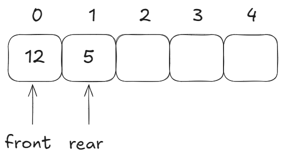
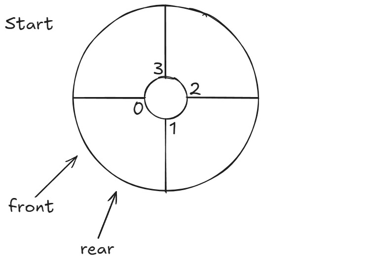

# Circular Queue

A queue is a list with the restriction that you can insert at the front of the list
and you can delete at the end of the list.

A circular queue has the advantage of constantly reusing empty spaces in the list.

## Linear Queue Array
```c
typedef struct{
    int que[size];

    int front;
    int rear;
} Queue;
```
#### que
The actual array of Queue.

#### front
The front of the Queue, this is where you ### [EnQueue] in the Queue.
front starts at index 0.

#### rear
The rear of the Queue, this is where you ### [DeQueue] in the Queue.
rear starts at index 0.



## Queue Operataions
### EnQueue
The function inserts a value in rear and increases rear.
if rear is greater than size we modulo front so it resets to 0.
```c
void EnQueue(Queue* queue, int val){
    queue->que[queue->rear] = val;
    queue->rear = (queue->rear+1)%size;
}
```

### DeQueue
The function saves front in data; increments front; and returns data.
if front is greater than size we modulo front so it resets to 0.
```c
return DeQueue(Queue* queue){
    int data queue->que[queue->front];
    queue->front = (queue->front+1)%size;
    return data;
}
```


### IsFull
 The function check if the Queue is full by checking if rear an index behind front.
```c
bool isFull(int rear){
    bool full = false;
    if((rear+1)%size == front)
        full = true;
    return true;
}
```

### IsEmpty
 The function check if the Queue is full by checking if rear is equal to full.
```c
bool isEmpty(int rear){
    bool empty = false;
    if(rear == front)
        empty = true;
    return true;
}
```
## Reference
### Linear Version
[Linear Queue](Queue.md)
### Linked List Version
[Queue linked List](Queue_LinkedList.md)
### Examples
[Time Share](Examples/timeShare.c)
[Back To Main](readme.md)
