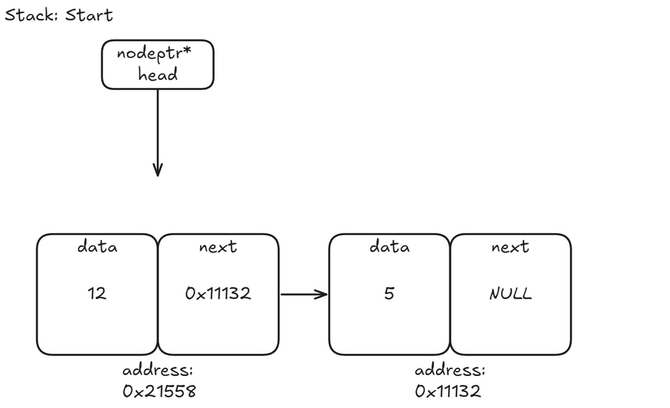

# Stacks Linked List

The linked list version of a stack uses node structures and node references instead of
an array. This makes the stack have a dynamic size.
## Stack Linked List;
```c
typedef struct node* nodeptr;
struct node{
    int val;
    nodeptr next;
} Node;
```
#### val
The value stored in the node.
#### stk
The pointer connecting the next node.

#### Linked List Structure


## Stack Operations
### Push
The function creates a new node and inserts the current top/head node next to the new  node.
```c
void push(nodeptr* head, int val){
    nodeptr node = malloc(sizeof(Node));
    node->val = val;
    node->next = *head;
    *head = node;
}
```

### Pop
The function outputs the value in tos and moves tos lower by 1.
```c
int pop(nodeptr* head){
    int data = (*head)->data;
    nodeptr temp = *head;
    *head = temp->next;
	free(temp);
    return data;
}
```

``` 
The free function deallocates the memory of the node pointer so the program reuse the memory from the free'd node.
```
### IsFull
Because a linked list is dynamic it can never be full.

### IsEmpty
Functions checks if the stack is empty by checking if tos is equal to -1.

```c
bool isEmpty(nodeptr head){
    bool empty = false;
    if(head == NULL){
	    empty = true;
    }
    return empty;
}
```

### Peek
Function will output the value in the top of the stack/(the head node).
```c
int peek(nodeptr head){
    int data = head.val;
    return data;
}
```
## References
### Array version
[Stack Linked List](Stack_LinkedList.md)
### Examples
[Binary Convertion](Examples/convertToBinL.c)<br>
[PostFix Calculator](Examples/postfixL.c)<br>
[InFix to PostFix Converter](Examples/in2postfixL.c)<br>


[Back To Main](readme.md)
