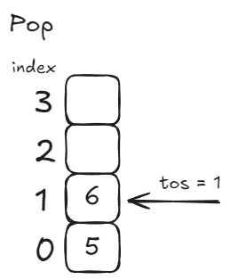

# Stacks Linked List

The linked list version of a stack uses node structures and node references instead of
an array. This makes the stack have a dynamic size.
## Stack Linked List;
```c
typedef struct node* nodeptr;
struct node{
    int val;
    nodeptr next;
} Node;
```
#### val
The value stored in the node.
#### stk
The pointer connecting the next node.

#### Linked List Structure


## Stack Operations
### Push
The function creates a new node and inserts the current top/head node next to the new  node.
```c
void push(Node* head, int val){
	nodeptr node = malloc(sizeof(Node));
    node->val = val;
    node->next = *head;
    *head = node;
}
```

### Pop
The function outputs the value in tos and moves tos lower by 1.
```c
int push(Stack* stack){
	int data = stack->stk[stack->tos];
	stack->tos -= 1;
	return data;
}
```

``` 
Even though the numbers are not removed in the array because its above tos, we cant really see them anymore.
```
### IsFull
Functions checks if the stack is full by checking if tos is equal to the last index.
```c
bool isFull(int tos){
	bool full = false;
	if(tos == size - 1){
		full = true;
	}
	return full;
}
```
### IsEmpty
Functions checks if the stack is empty by checking if tos is equal to -1.
```c
bool isEmpty(int tos){
	bool empty = false;
	if(tos == -1){
		empty = true;
	}
	return empty;
}
```

### Peak
Function will output the value in tos but will not move tos.
```c
int peak(Stack stack){
	int data = stack.stk[stack.tos];
	return data;
}
```
